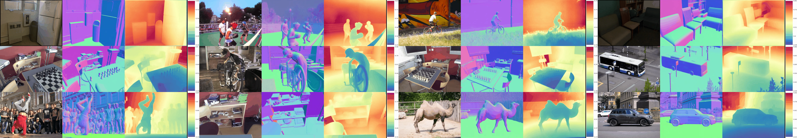

# UniGeo: Taming Video Diffusion for Unified Consistent Geometry Estimation

[](https://arxiv.org/abs/2505.24521)
[](https://sunyangtian.github.io/UniGeo-web/)

<p align="center">
  
</p>


In this repo, we provide a unified framework for geometry estimation and evaluation.

Our framework provides a convenient interface for **various dataset** and **various methods**, which supports a fair comparison by aligning the output and evaluation scripts.
<p align="center">
  
</p>

### Evaluation (in progressing ... )
```
  python eval.py
```


### Supported Datasets
Please refer to [dataset](./dataset/Readme.md) for more details.


### Supported Methods
Please refer to [model](./model/Readme.md) for more details.

### Acnowledgement
This code borrows heavily from [Spann3R](https://github.com/HengyiWang/spann3r), [Monst3R](https://github.com/Junyi42/monst3r), [CUT3R](https://github.com/CUT3R/CUT3R) and [robustmvd](https://github.com/lmb-freiburg/robustmvd). Thanks for these awesome works.


---
If you find this work helpful, please consider citing
```
@article{sun2025UniGeo,
  title={UniGeo: Taming Video Diffusion for Unified Consistent Geometry Estimation},
  author={Sun, Yang-Tian and Yu, Xin and Huang, Zehuan and Huang, Yi-Hua and Guo, Yuan-Chen and Yang, Ziyi and Cao, Yan-Pei and Qi, Xiaojuan},
  journal={arXiv preprint arXiv:2505.24521},
  year={2025}
}
```