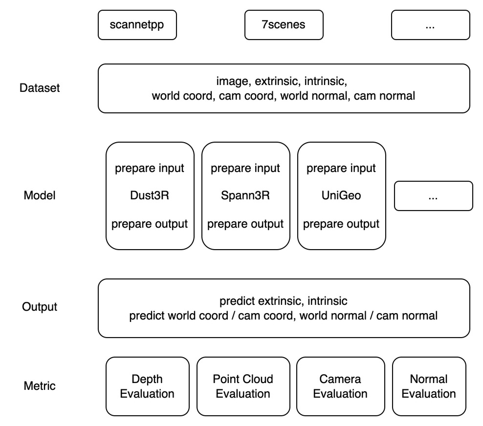

# UniGeo: Taming Video Diffusion for Unified Consistent Geometry Estimation

In this repo, we provide a unified framework for geometry estimation and evaluation.

Our framework provides a convenient interface for **various dataset** and **various methods**, which supports a fair comparison by aligning the output and evaluation scripts.

  

### Supported Dataset
- [x] hypersim
- [x] interiornet
- [ ] matrixcity
- [ ] vkitti
- [x] scannetpp
- [x] 7scenes
- [x] replica
- [x] bonn
- [x] sintel
- [x] neuralRGBD
- [x] tumRGBD
- [x] scannetv2

### Unified Data Format
- data['scene_name']:
- data['images']:
- data['image_names']:
- data['intrinsics']:
- data['extrinsics]: OpenGL Coordinate
- data['cam_coord']:    
- data['cam_normal']:
- data['world_coord']: OpenGL Coordinate
- data['world_normal']: OpenGL Coordinate
- data['keyview_idx']: Reference frame index
- data['mask']: Valid pixel mask

### Supported Methods
- [x] CUT3R 
- [x] Spann3R 
- [x] Dust3R 
- [x] AETHER 
- [x] UniGeo 
- [x] VideoDepthAnything 
- [x] ChronoDepth 
- [x] DepthCrafter 
- [x] DepthAnyVideo 
