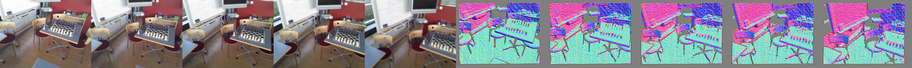

### Supported Dataset
- [x] hypersim
- [x] interiornet
- [ ] matrixcity
- [ ] vkitti
- [x] scannetpp
- [x] 7scenes
- [x] replica
- [x] bonn
- [x] sintel
- [x] neuralRGBD
- [x] tumRGBD
- [x] scannetv2

We convert these datasets into a unified data format, which can be used for training / evaluation conveniently with the same interface.

For each dataset, you need to specify the split file (`$dataset$/splits`) and sequence initialization (`$dataset$/$dataset$.py`). You can check your implementation using `test_vis_dataset.py`. If everything goes well, you can get images like this:

### Unified Data Format
- data['scene_name']: string, e.g., 'chess_seq-03'
- data['images']: list of [3,H,W], 0~255
- data['image_names']: list of string, ['frame-000000.color.png', ...]
- data['intrinsics']: list of [3,3]
- data['extrinsics]: list of [4,4]
- data['cam_coord']: list of [3,H,W]   
- data['cam_normal']: list of [3,H,W]
- data['world_coord']: list of [3,H,W]
- data['world_normal']: list of [3,H,W]
- data['keyview_idx']: Reference frame index, usually 0
- data['mask']: Valid pixel mask, list of [H,W]